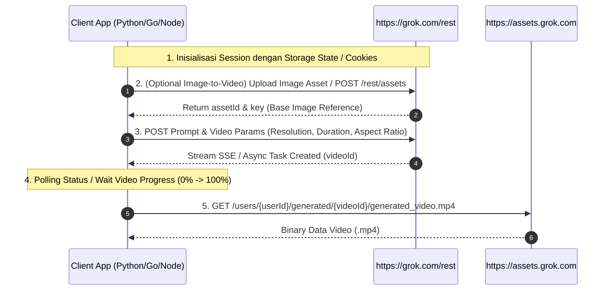

# Panduan Dokumentasi & Spesifikasi API Generasi Video Grok (`grok-api.md`)

Dokumen ini menjelaskan alur kerja, metode HTTP/REST, struktur Cookie/Session, serta langkah-langkah teknis untuk mengimplementasikan sistem generasi video Grok (`grok.com`) di bahasa pemrograman lain (seperti **Python**, **Go**, **PHP**, **C#**, atau **Rust**).

---

## 📌 1. Konsep Dasar & Arsitektur Sistem

Grok (`https://grok.com/imagine`) menggunakan kombinasi REST API, WebSocket/SSE (Server-Sent Events), dan proteksi **Cloudflare Turnstile/WAF**.

### Elemen Utama Autentikasi:
Untuk berinteraksi dengan API Grok tanpa login manual berulang kali, Anda perlu menyimpan dan membawa **Session Cookies** dari file state JSON (`storageState`):
- `sso` & `sso-rw`: JWT Session Token autentikasi pengguna xAI / Grok.
- `x-userid`: ID unik pengguna (UUID, contoh: `d805eded-4357-4c59-8d3a-15ed7ede624a`).
- `grok_device_id`: ID perangkat acak (UUID).
- `cf_clearance` & `__cf_bm`: Token bypass Cloudflare WAF.

> 💡 **Catatan Penting:** Karena Grok dilindungi Cloudflare, membuat request HTTP murni dari library HTTP standar (seperti `requests` di Python atau `net/http` di Go) terkadang terbentur Cloudflare CAPTCHA jika TLS Fingerprint tidak sesuai. Oleh karena itu, pendekatan paling stabil di bahasa apapun adalah **Headless Browser Automation (Playwright/Selenium)** atau library TLS spoofing (seperti `curl_cffi` di Python).

---

## 🔄 2. Tahapan & Workflow Generasi Video (Step-by-Step)



---

## 🛠️ 3. Rincian Endpoint & HTTP Request

### A. Cek Kuota & Session Status
* **HTTP Method:** `POST`
* **URL:** `https://grok.com/rest/media/imagine/quota_info`
* **Headers:**
  ```http
  Content-Type: application/json
  Cookie: sso=...; sso-rw=...; x-userid=...; grok_device_id=...; cf_clearance=...
  User-Agent: Mozilla/5.0 (Windows NT 10.0; Win64; x64) AppleWebKit/537.36 ...
  Referer: https://grok.com/imagine
  ```
* **Payload:** `{}`
* **Response Contoh:**
  ```json
  {
    "remainingQuota": 50,
    "limit": 100
  }
  ```

---

### B. Upload Gambar (Jika Image-to-Video)
Jika Anda melakukan generasi dari gambar (Image-to-Video):
* **HTTP Method:** `POST`
* **URL:** `https://grok.com/rest/assets`
* **Response Contoh:**
  ```json
  {
    "assetId": "91c6c93b-6cae-4784-994b-4732e0fd76c0",
    "key": "users/d805eded-4357-4c59-8d3a-15ed7ede624a/91c6c93b-6cae-4784-994b-4732e0fd76c0/content",
    "mimeType": "image/jpeg"
  }
  ```

---

### C. Mengirim Request Generasi Video
* **Payload Konfigurasi Utama:**
  ```json
  {
    "prompt": "A cinematic futuristic neon city @ref.jpg",
    "mode": "video",
    "resolution": "720p",
    "duration": "5s",
    "aspectRatio": "9:16",
    "useImageRef": true
  }
  ```
* **Opsi Parameter:**
  - `resolution`: `'720p'` atau `'1080p'`
  - `duration`: `'5s'` atau `'10s'`
  - `aspectRatio`: `'9:16'` (Portrait / TikTok), `'16:9'` (Landscape / YT), `'1:1'` (Square)

---

### D. Mengunduh Video MP4
Setelah proses render di server Grok selesai, hasil video diakses via CDN Grok:
* **HTTP Method:** `GET`
* **URL:** `https://assets.grok.com/users/{userId}/generated/{videoId}/generated_video.mp4?cache=1`
* **Headers Wajib:**
  ```http
  Referer: https://grok.com/
  Cookie: sso=...; sso-rw=...; cf_clearance=...
  ```

---

## 💻 4. Contoh Implementasi di Bahasa Lain

### A. Contoh Implementasi di **PYTHON** (Playwright Async)

Metode ini paling direkomendasikan untuk Python karena menangani Cloudflare & Cookies secara otomatis di background (Headless).

```python
# grok_generator.py
import asyncio
import json
import os

from playwright.async_api import async_playwright


async def generate_grok_video(
    state_file_path: str,
    prompt: str,
    image_path: str = None,
    resolution: str = "720p",
    duration: str = "5s",
    aspect_ratio: str = "9:16",
    output_download_dir: str = "./downloads",
):
    async with async_playwright() as p:
        # 1. Launch Browser Headless (Tanpa GUI Window)
        browser = await p.chromium.launch(
            headless=True,
            args=["--disable-blink-features=AutomationControlled", "--no-sandbox"],
        )

        # 2. Load Session Cookies & Context
        context = await browser.new_context(
            storage_state=state_file_path,
            viewport={"width": 1366, "height": 768},
            user_agent="Mozilla/5.0 (Windows NT 10.0; Win64; x64) AppleWebKit/537.36 (KHTML, like Gecko) Chrome/134.0.0.0 Safari/537.36",
        )

        page = await context.new_page()

        print("🌐 Navigasi ke Grok Imagine...")
        await page.goto("https://grok.com/imagine", wait_until="domcontentloaded")
        await page.wait_for_timeout(3000)

        # 3. Inject Script Automasi Frontend (grok_autoV2.js)
        with open("grok_autoV2.js", "r", encoding="utf-8") as f:
            script_content = f.read()

        await page.evaluate(script_content)
        await page.wait_for_timeout(1000)

        # Encode image to Base64 jika ada
        image_b64 = None
        image_name = None
        if image_path and os.path.exists(image_path):
            import base64

            with open(image_path, "rb") as img_f:
                image_b64 = base64.b64encode(img_f.read()).decode("utf-8")
                image_name = os.path.basename(image_path)

        # 4. Trigger Generate
        gen_config = {
            "prompt": prompt,
            "mode": "video",
            "image": image_b64,
            "imageName": image_name or "ref.jpg",
            "resolution": resolution,
            "duration": duration,
            "aspectRatio": aspect_ratio,
            "useImageRef": bool(image_b64),
        }

        print("🚀 Mengirim request generate video ke Grok...")
        result = await page.evaluate(
            "cfg => window.__grokGenerate(cfg)", gen_config
        )

        if not result or result.get("status") != "done":
            raise Exception(f"Gagal generate video: {result.get('error')}")

        video_url = result.get("videoUrl")
        print(f"✅ Video berhasil dibuat: {video_url}")

        # 5. Download Video MP4
        os.makedirs(output_download_dir, exist_ok=True)
        save_path = os.path.join(output_download_dir, "grok_video.mp4")

        # Fetch video binary via page context (dengan cookie)
        video_bytes_b64 = await page.evaluate(
            """async (url) => {
            const r = await fetch(url, { credentials: 'include' });
            const b = await r.blob();
            return new Promise(res => {
                const rd = new FileReader();
                rd.onloadend = () => res(rd.result.split(',')[1]);
                rd.readAsDataURL(b);
            });
        }""",
            video_url,
        )

        import base64

        with open(save_path, "wb") as out_f:
            out_f.write(base64.b64decode(video_bytes_b64))

        print(f"💾 Video tersimpan di: {save_path}")
        await browser.close()
        return save_path


# Jalankan fungsi
if __name__ == "__main__":
    asyncio.run(
        generate_grok_video(
            state_file_path="grok-states/grok-state-indra.json",
            prompt="Cyberpunk street in rain with neon lights",
            resolution="720p",
            duration="5s",
            aspect_ratio="9:16",
        )
    )
```

---

### B. Contoh Implementasi Direct HTTP via **cURL**

Jika Anda menguji via terminal / script shell menggunakan cookie:

```bash
curl -X GET "https://assets.grok.com/users/d805eded-4357-4c59-8d3a-15ed7ede624a/generated/70f98d67-cebf-4a51-8fca-bbc62d62a3d4/generated_video.mp4?cache=1" \
  -H "User-Agent: Mozilla/5.0 (Windows NT 10.0; Win64; x64) AppleWebKit/537.36" \
  -H "Referer: https://grok.com/" \
  -H "Cookie: sso=eyJ0eXAiOiJKV1QiLCJhbGciOiJIUzI1NiJ9...; sso-rw=eyJ0eXAiOiJKV1QiLCJhbGciOiJIUzI1NiJ9...; x-userid=d805eded-4357-4c59-8d3a-15ed7ede624a; cf_clearance=kmCv_.IdJrzWfetGsoCwW6k2HBykmf3FrNa6TNB..." \
  --output result_video.mp4
```

---

## ⚠️ Ringkasan Tips Penanganan Error

1. **Error 403 Forbidden / Cloudflare Challenge:**
   - Disebabkan cookie `cf_clearance` kedaluwarsa atau User-Agent tidak cocok.
   - Solusi: Selalu gunakan Playwright / Selenium headless context yang memuat `storageState` JSON.
2. **Error Rate Limit (Supergrok / Limit Exceeded):**
   - Grok membatasi jumlah generasi per akun per jam.
   - Tangkap respons status `rate_limited` dan ganti ke state akun lain (`grok-state-2.json`).
3. **Format Video MP4 Kosong (0 Byte):**
   - Pastikan saat mendownload file `.mp4` dari `assets.grok.com`, header `Referer: https://grok.com/` dan `Cookie` tetap dikirimkan.
