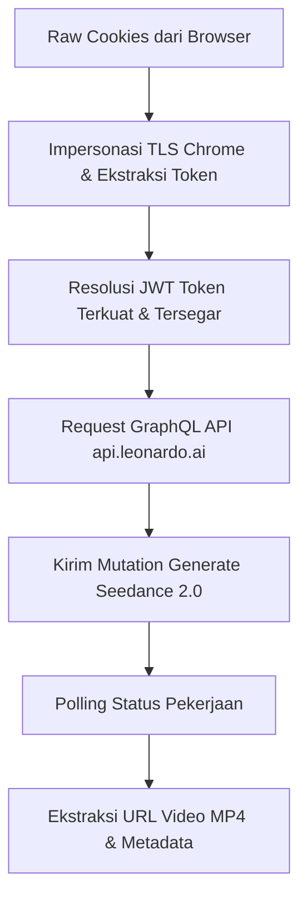

# Analisis Sistem: Generator Video Leonardo AI dengan Cookie (Go to JavaScript Guide)

Dokumen ini menjelaskan secara sistematis bagaimana program **LeoStudio** (ditulis dalam Go) berhasil melakukan integrasi dengan Leonardo AI untuk memicu dan mengunduh hasil video generator, hanya dengan menggunakan **raw cookies** dari browser.

Panduan ini dirancang agar Anda dapat dengan mudah mengimplementasikan ulang alur sistem ini ke dalam versi **JavaScript/TypeScript (Node.js)** pada prompt Anda berikutnya.

---

## 📌 Ringkasan Alur Sistem

Sistem ini bekerja melalui 5 tahapan utama:



---

## 1. Bypass Proteksi Vercel & Impersonasi TLS (Chrome TLS Fingerprint)

### Masalah Utama:
Domain utama Leonardo AI (`app.leonardo.ai`) berada di balik proteksi keamanan **Vercel Security Checkpoint**. Vercel melakukan **TLS Fingerprinting** (seperti JA3 fingerprint). Jika Anda menembak endpoint ini menggunakan client HTTP biasa seperti Node `fetch`, `axios`, atau library Go standar, request akan langsung diblokir (biasanya mengembalikan status `403 Forbidden` atau tantangan Cloudflare/Vercel).

### Solusi di Go:
Program menggunakan library `github.com/imroc/req/v3` yang memiliki fitur `.ImpersonateChrome()`. Ini meniru persis handshake TLS, urutan cipher suites, dan header browser Google Chrome sehingga bypass lolos tanpa hambatan.

### 💡 Rencana Porting ke JavaScript:
Untuk Node.js, `axios` atau `fetch` bawaan kemungkinan besar akan **diblokir** oleh Vercel saat mengambil session token dari `app.leonardo.ai`. Anda harus menggunakan salah satu alternatif berikut:
1. **`got-scraping`**: Library Node.js populer yang secara otomatis meniru TLS fingerprint browser (Chrome/Firefox).
2. **`puppeteer` / `playwright`**: Menjalankan browser headless/headful untuk memicu request session token secara natural menggunakan cookie Anda.
3. **`curl-impersonate`**: Wrapper Node.js untuk curl-impersonate yang menggantikan TLS stack Node.js dengan TLS Firefox/Chrome.

*Catatan: Setelah session token (JWT Bearer) berhasil didapatkan, Anda bisa menggunakan `fetch` atau `axios` standar untuk menembak API GraphQL (`api.leonardo.ai/v1/graphql`) karena endpoint API ini tidak seketat checkpoint Vercel di frontend.*

---

## 2. Strategi Ekstraksi & Resolusi Token (Token Resolver)

Sistem ini sangat tangguh karena tidak hanya bergantung pada satu jenis cookie. Leonardo AI telah bermigrasi dari `next-auth` ke `better-auth`. Kode Go mengimplementasikan **3 strategi fallback** untuk mengekstrak JWT Bearer Token:

### Strategi A: Better-Auth Session (Utama)
Program melakukan `GET` request ke:
`https://app.leonardo.ai/api/auth/get-session`
*   **Header wajib**: `Cookie: <seluruh cookie string>` + Header impersonasi Chrome.
*   **Hasil**: Mengembalikan payload JSON yang berisi data user dan session token.
*   **Pencarian**: Menelusuri seluruh objek JSON untuk mencari string JWT (JSON Web Token) yang valid.

### Strategi B: Next-Auth Legacy Session (Fallback 1)
Mengambil CSRF token dari cookie (seperti `__Secure-next-auth.csrf-token` atau `__Host-authjs.csrf-token`).
1. Melakukan `POST` ke `https://app.leonardo.ai/api/auth/session` dengan body JSON berisi `{"csrfToken": "<token>"}`.
2. Jika gagal, lakukan `GET` ke `https://app.leonardo.ai/api/auth/session`.
3. Telusuri respons JSON untuk mencari JWT token di field seperti `accessToken`, `idToken`, atau `user.accessToken`.

### Strategi C: Ekstraksi Langsung dari Cookie (Fallback 2)
Jika request API session gagal, program langsung membedah string cookie mentah dan mencari nilai dari key:
*   `__Secure-next-auth.session-token`
*   `next-auth.session-token`
*   `__Secure-authjs.session-token`
*   `authjs.session-token`

### 🔍 Logika Pemilihan Token Terbaik (Token Scoring & Validation)
Jika ditemukan beberapa token JWT dari cookie tersebut, program akan menyaring dan merankingnya dengan aturan berikut:
1. **Validasi Format JWT**: Harus memiliki 3 bagian yang dipisahkan titik (`header.payload.signature`).
2. **Validasi Kedaluwarsa (TTL)**: Mendekode payload base64 JWT, membaca field `exp`, dan memastikan token masih aktif minimal untuk 120 detik ke depan (`exp > current_time + 120`).
3. **Penyaringan Cognito**: Lebih memprioritaskan token yang memiliki klaim `iss` mengandung `"cognito-idp"` atau memiliki key `"cognito:username"`.
4. **Ranking Tipe Token**:
   *   `access_token` mendapat skor **3** (Prioritas Utama)
   *   `id_token` mendapat skor **2**
   *   Token lainnya mendapat skor **1**
Sistem akan memilih token dengan skor tertinggi.

---

## 3. Komunikasi dengan API GraphQL Leonardo

Setelah Bearer JWT Token berhasil didapatkan, seluruh request berikutnya dikirim ke endpoint GraphQL pusat Leonardo:
`https://api.leonardo.ai/v1/graphql`

### Header Penting & Anti-Detection (Sentry & Baggage)
Agar request terlihat natural seperti dikirim dari aplikasi web resmi Leonardo, program menyusun header khusus:
*   `Authorization`: `Bearer <JWT_TOKEN>`
*   `x-leo-schema-version`: `latest`
*   `Origin`: `https://app.leonardo.ai`
*   `Referer`: `https://app.leonardo.ai/`
*   **Imitasi Sentry**: Menambahkan header pelacak Sentry untuk menghindari deteksi bot:
    *   `sentry-trace`: `<trace_id>-<span_id>-0`
    *   `baggage`: Header berisi metadata Sentry release (misal: `sentry-environment=vercel-production`, `sentry-release=6a0bd1b5b...`).

---

## 4. Alur Pembuatan Video (Video Generation Flow)

Pembuatan video di Leonardo AI menggunakan model bernama **Seedance** (misalnya `seedance-2.0` atau `seedance-2.0-fast`).

### GraphQL Mutation: `Generate`
Request dikirim dengan method `POST` ke endpoint GraphQL dengan payload JSON berikut:

*   **Operation Name**: `Generate`
*   **Query GraphQL**:
    ```graphql
    mutation Generate($request: CreateGenerationRequest!) {
      generate(request: $request) {
        apiCreditCost
        generationId
        __typename
      }
    }
    ```
*   **Variables**:
    ```json
    {
      "request": {
        "model": "seedance-2.0",
        "public": true,
        "parameters": {
          "width": 720,
          "height": 1280,
          "duration": 4,
          "mode": "RESOLUTION_720",
          "motion_has_audio": false,
          "quantity": 1,
          "prompt": "Animasi 3D cinematic dari seekor kucing astronot di luar angkasa",
          "seed": -1
        }
      }
    }
    ```

#### 💡 Image-to-Video (Start & End Frame):
Jika Anda ingin menyertakan gambar inisiasi (Image to Video), program Go mendukung penambahan objek `guidances` di dalam `parameters`:
```json
"guidances": {
  "start_frame": [
    {
      "image": {
        "id": "UUID-GAMBAR-INIT-YANG-SUDAH-DIUPLOAD",
        "type": "UPLOADED"
      }
    }
  ]
}
```

Mutation ini akan mengembalikan **`generationId`** (contoh: `abc123e4-d56f-78gh-...`).

---

## 5. Polling Status Pekerjaan

Karena proses generate video memakan waktu (biasanya 30 detik - 2 menit), program melakukan polling secara berkala (misalnya setiap 2-5 detik) untuk memeriksa status job.

### GraphQL Query: `GetAIGenerationFeedStatuses`
*   **Operation Name**: `GetAIGenerationFeedStatuses`
*   **Query**:
    ```graphql
    query GetAIGenerationFeedStatuses($where: generations_bool_exp = {}) {
      generations(where: $where) {
        id
        status
        __typename
      }
    }
    ```
*   **Variables**:
    ```json
    {
      "where": {
        "id": {
          "_eq": "UUID_GENERATION_ID"
        }
      }
    }
    ```
*   **Status yang dipantau**:
    *   `PENDING` / `PROCESSING`: Tetap tunggu dan ulangi polling.
    *   `COMPLETE` / `COMPLETED`: Berhasil! Lanjut ke langkah ekstraksi URL.
    *   `FAILED` / `ERROR`: Gagal (kredit habis, prompt NSFW, dll).

---

## 6. Ekstraksi Hasil Video MP4

Setelah status berubah menjadi `COMPLETE`, langkah terakhir adalah mengambil URL video `.mp4` yang telah di-render.

### GraphQL Query: `GetVideoGenerationFeed`
*   **Operation Name**: `GetVideoGenerationFeed`
*   **Query**:
    ```graphql
    query GetVideoGenerationFeed($where: generations_bool_exp = {}, $limit: Int) {
      generations(where: $where, limit: $limit) {
        id
        status
        motionDurationSeconds
        motionGenerationResolution
        generated_images(order_by: [{url: desc}]) {
          id
          url
          motionMP4URL
          motionGIFURL
          image_width
          image_height
          __typename
        }
        __typename
      }
    }
    ```
*   **Variables**:
    ```json
    {
      "where": {
        "id": {
          "_eq": "UUID_GENERATION_ID"
        }
      },
      "limit": 1
    }
    ```

### Hasil Akhir:
Di dalam array `generated_images`, Anda akan menemukan:
*   `motionMP4URL`: URL langsung ke file video `.mp4` (biasanya dihosting di S3 AWS).
*   `url`: URL ke gambar thumbnail `.jpg` dari video tersebut.
*   `motionGIFURL`: Animasi gif singkat preview.

---

## 7. Sistem Melihat Sisa Kredit/Token (Get Credit Balance)

Program Go memiliki fitur untuk melacak sisa token/kredit pengguna melalui GraphQL. Ini berguna untuk memastikan akun memiliki saldo kredit yang cukup sebelum memicu pembuatan video.

### Cara Mendapatkan Sisa Kredit:
Leonardo AI menyimpan informasi sisa kredit di tabel `user_details`. Program mengimplementasikan **2 skema query berjenjang** untuk mendapatkan detail ini:

#### Skema A: Menggunakan `userSub` dari JWT (Metode Utama)
Program pertama-tama membaca payload JWT untuk mencari field `"sub"` (Cognito User ID unik). Jika ditemukan, program mengirimkan query **`GetUserDetails`**:
*   **Operation Name**: `GetUserDetails`
*   **Query**:
    ```graphql
    query GetUserDetails($userSub: String) {
      users(where: {user_details: {cognitoId: {_eq: $userSub}}}) {
        id
        user_details {
          subscriptionTokens
          paidTokens
          rolloverTokens
          auth0Email
          __typename
        }
        __typename
      }
    }
    ```
*   **Variables**:
    ```json
    {
      "userSub": "UUID-USER-SUB-DARI-JWT"
    }
    ```

#### Skema B: Generic Token Balance (Fallback)
Jika field `sub` tidak ada pada JWT, atau query utama gagal, program menembak query fallback **`GetTokenBalance`** yang tidak membutuhkan variabel parameter apa pun:
*   **Operation Name**: `GetTokenBalance`
*   **Query**:
    ```graphql
    query GetTokenBalance {
      user_details {
        subscriptionTokens
        paidTokens
        rolloverTokens
        auth0Email
        __typename
      }
    }
    ```

### 🧮 Rumus Menghitung Total Kredit (Token Balance)
Sisa kredit dihitung dengan menjumlahkan ketiga jenis token berikut dari respons server:
$$\text{Total Sisa Kredit} = \text{subscriptionTokens} + \text{paidTokens} + \text{rolloverTokens}$$

*   `subscriptionTokens`: Kredit gratis harian / bulanan sesuai tingkat paket langganan.
*   `paidTokens`: Kredit tambahan yang dibeli (tidak hangus).
*   `rolloverTokens`: Sisa kredit bulan lalu yang terakumulasi.

---

## 🛠️ Rencana Blueprint Struktur Kode JavaScript (Node.js)

Saat Anda meminta pembuatan versi JavaScript, berikut adalah struktur modular yang sangat direkomendasikan:

```javascript
// Struktur file yang disarankan untuk projek Node.js/TypeScript Anda:
// ├── leonardo-client.js   <-- Core Client (Penanganan TLS/Authentication/GraphQL)
// ├── auth-helper.js       <-- Helper untuk parsing & scoring JWT
// ├── video-service.js     <-- Logika pembuatan video (Generate, Poll, Get URL)
// └── index.js             <-- Entry point penggunaan script

// CONTOH OUTLINE DETEKSI JWT & CEK KREDIT PADA JAVASCRIPT:
function decodeJWTPayload(token) {
  try {
    const parts = token.split('.');
    if (parts.length !== 3) return null;
    const payload = Buffer.from(parts[1], 'base64').toString('utf8');
    return JSON.parse(payload);
  } catch (e) {
    return null;
  }
}

function isFreshToken(token, minTTL = 120) {
  const payload = decodeJWTPayload(token);
  if (!payload || !payload.exp) return true; // Anggap fresh jika tanpa exp
  const now = Math.floor(Date.now() / 1000);
  return payload.exp > (now + minTTL);
}

// FUNGSI UNTUK MELIHAT SISA KREDIT
async function getCreditBalance(token, graphqlFetchFunction) {
  const payload = decodeJWTPayload(token);
  const userSub = payload?.sub || "";
  
  // Query Utama
  const primaryQuery = `
    query GetUserDetails($userSub: String) {
      users(where: {user_details: {cognitoId: {_eq: $userSub}}}) {
        user_details {
          subscriptionTokens
          paidTokens
          rolloverTokens
          auth0Email
        }
      }
    }
  `;
  
  try {
    const response = await graphqlFetchFunction(token, {
      operationName: "GetUserDetails",
      query: primaryQuery,
      variables: { userSub }
    });
    
    const user = response.data?.users?.[0];
    const details = user?.user_details?.[0];
    
    if (details) {
      const totalCredits = (details.subscriptionTokens || 0) + 
                           (details.paidTokens || 0) + 
                           (details.rolloverTokens || 0);
      return {
        email: details.auth0Email,
        credits: totalCredits
      };
    }
  } catch (error) {
    console.log("Primary query failed, trying fallback...", error.message);
  }
  
  // Fallback Query jika query pertama gagal
  const fallbackQuery = `
    query GetTokenBalance {
      user_details {
        subscriptionTokens
        paidTokens
        rolloverTokens
        auth0Email
      }
    }
  `;
  
  const responseFallback = await graphqlFetchFunction(token, {
    operationName: "GetTokenBalance",
    query: fallbackQuery,
    variables: {}
  });
  
  const details = responseFallback.data?.user_details?.[0];
  if (!details) throw new Error("Gagal mengambil informasi kredit pengguna.");
  
  const totalCredits = (details.subscriptionTokens || 0) + 
                       (details.paidTokens || 0) + 
                       (details.rolloverTokens || 0);
  return {
    email: details.auth0Email,
    credits: totalCredits
  };
}
```


---

*Gunakan dokumen `.md` ini sebagai acuan instruksi/prompt Anda berikutnya saat menginstruksikan AI untuk menulis versi JavaScript yang lengkap dan andal!*
